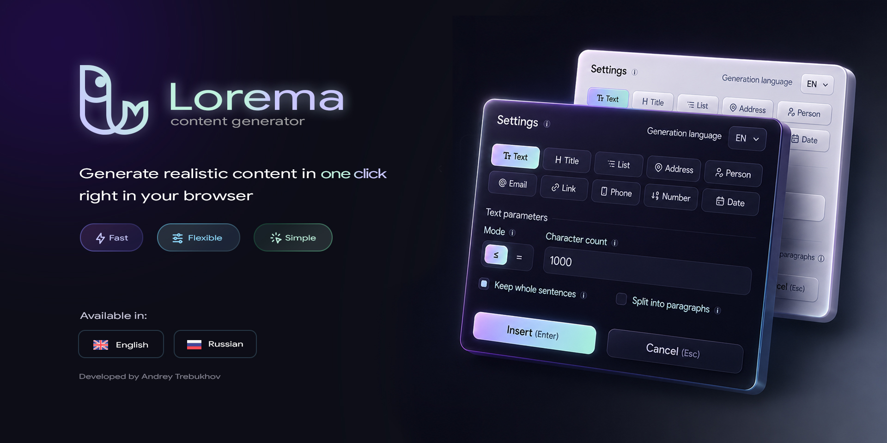

# Lorema

Read this in other languages: English | [Русский](./README_ru.md)

**Lorema** is a browser extension for quickly inserting generated placeholder content into editable fields.

It helps developers, designers, QA engineers, and content editors fill forms, inputs, textareas, and editable areas without manually typing test data.

## Features

- Insert generated content from the context menu
- Quick insert with saved settings
- Custom insert with a configuration popover
- Keyboard shortcut support
- Works with inputs, textareas, and contenteditable elements
- Supports light and dark themes
- Interface languages: English and Russian

## Content types

Lorema can generate:

- text
- titles
- email addresses
- links
- phone numbers
- addresses
- first names
- last names

## Tech stack

- TypeScript
- Vite
- Chrome Extension Manifest V3
- CSS

## Development

Install dependencies:

```bash
npm install
```

Run development build in watch mode:

```bash
npm run dev
```

Build production version:

```bash
npm run build
```

The compiled extension will be generated in the dist directory.

## License

This project is currently developed as a personal browser extension.