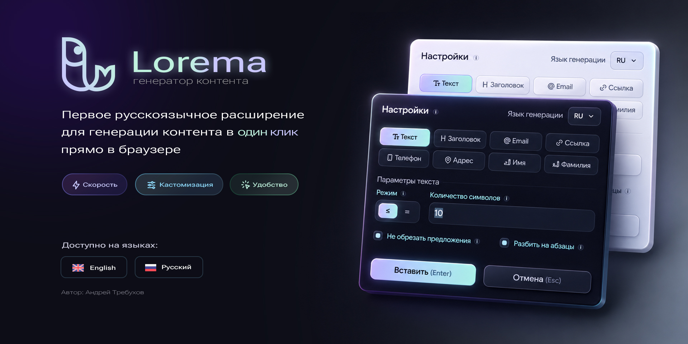

# Lorema

Прочесть README на других языках: [English](./README.md) | Русский

**Lorema** — первое браузерное расширение для быстрой вставки сгенерированного контента в редактируемые поля на **русском языке**.

Расширение помогает разработчикам, дизайнерам, QA-инженерам и редакторам быстро заполнять формы, инпуты, текстовые поля и редактируемые области тестовыми данными.

## Возможности

- Вставка сгенерированного контента через контекстное меню
- Быстрая вставка с сохранёнными настройками
- Вставка с настройкой через popover
- Поддержка горячей клавиши
- Работа с input, textarea и contenteditable
- Светлая и тёмная темы
- Языки интерфейса: русский и английский

## Типы контента

Lorema умеет генерировать:

- текст
- заголовки
- email-адреса
- ссылки
- номера телефонов
- адреса
- имена
- фамилии

## Стек

- TypeScript
- Vite
- Chrome Extension Manifest V3
- CRXJS Vite Plugin
- CSS

## Разработка

Установить зависимости:

```bash
npm install
```

Запустить сборку в режиме разработки:

```bash
npm run dev
```

Собрать production-версию:

```bash
npm run build
```

Готовое расширение появится в папке dist.

## License

Проект разрабатывается как персональное браузерное расширение.